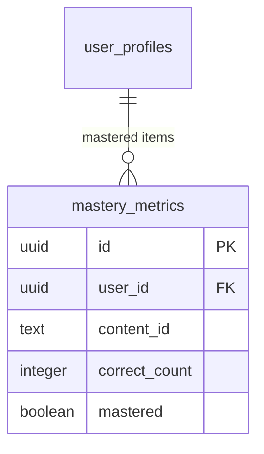

# Deep Attribute System & Knowledge Mastery

I have completed the deep integration of the **Attribute Builder** and the new **Knowledge Mastery** system. The application now functions as a unified engine for manifestation, where your study directly builds your character.

## Core Features Manifested

### 1. Persistent Attribute Growth
Attribute consistency levels are now stored in the database. 
- **Active Focus**: You can now set an "Active Building Focus" from the Attribute Builder. 
- **Dashboard Integration**: Your dashboard features a prominent focal widget for your active attribute, suggesting relevant learning paths.
- **Automatic Manifestation**: Completing a quiz with >70% score automatically grows attributes linked to those topics.

### 2. Knowledge Mastery System
A new persistent tracking system for Supreme Mathematics and Supreme Alphabet.
- **Born Threshold**: An item is officially "Mastered" (Born) after **5 correct quiz answers**.
- **Adaptive Quizzes**: The quiz engine now automatically prioritizes **unmastered subjects**, ensuring your study sessions focus on areas of growth.
- **Automatic Badging**: Items in the Mathematics and Alphabet modules dynamically display a "MASTERED" badge once the threshold is reached.

### 3. Born Notification System
A global, high-fidelity notification system that triggers whenever success is achieved.
- **Elevation**: Alerts you when an Attribute level increases.
- **Manifestation**: Celebrates when a Knowledge item is officially Mastered.

## Verification Proof

### Adaptive Quiz Filtering
The quiz engine now filters the available question pool based on your mastery status.

```javascript
// From src/views/modules/Quizzes.vue
const unmasteredMath = contentStore.mathematics.filter( m => !progressStore.isMastered( m.id ) )
const mathPool = unmasteredMath.length > 0 ? unmasteredMath : contentStore.mathematics
```

### Persistent Tracking
Knowledge items are tracked in the new `mastery_metrics` table.



## How to Test
1. **Set a Focus**: Go to **Attribute Builder**, select an attribute (e.g., Knowledge), and click **"Focus on this Attribute"**.
2. **Take a Quiz**: Go to the Dashboard and click **"Start Quiz"** (it will prioritize unmastered items).
3. **Achieve Mastery**: Correctly answer a specific number/letter 5 times.
4. **Watch the manifestation**: Observe the golden **Born Notification** and the updated **Mastered Badge** on the item card.

Peace. ✊🏿
